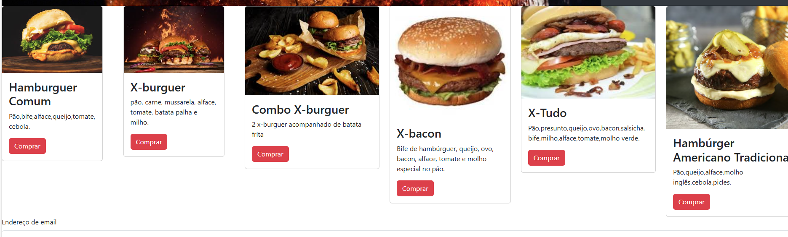
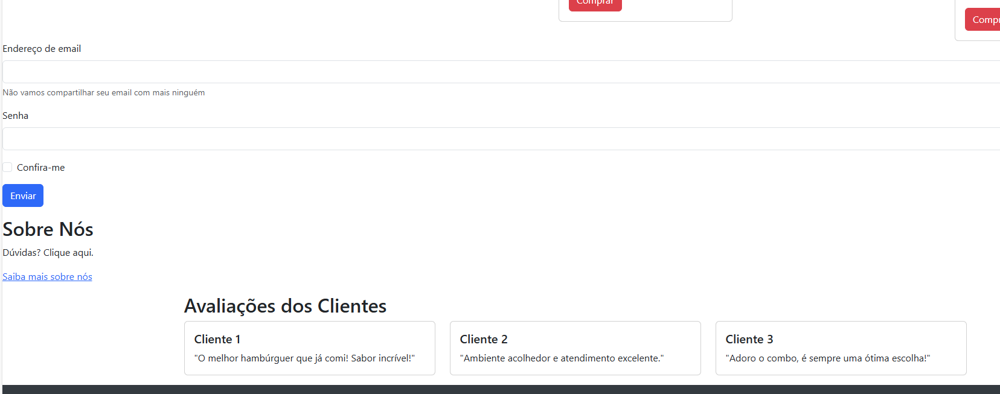
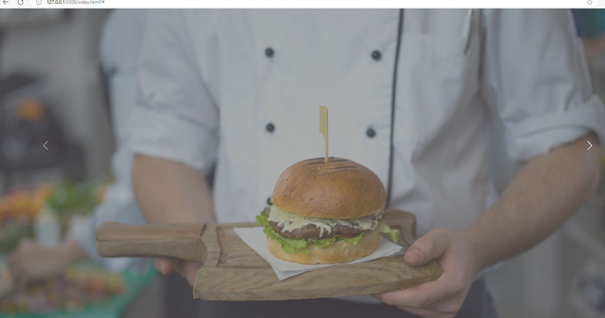

# Hamburgueria IA

## Introdução
Este site foi criado para apresentar nossa variedade de hambúrgueres artesanais, bem como fornecer informações sobre nossa história, produtos e avaliações de clientes.

## Etapas Implementadas
1. **Estrutura Básica**: Criei uma estrutura HTML básica com cabeçalho, corpo e rodapé.
2. **Navegação**: Implementei um menu de navegação com links para as seções do site.
3. **Carousel**: Adicionei um carrossel de imagens para destacar nossos produtos.
4. **Cards de Produtos**: Adicionei cards para exibir as opções de hambúrgueres disponíveis.
5. **Seções**:Procurei por códigos adicionais de seções adicionais como "Sobre Nós" e "Avaliações dos Clientes".
6. **Formulário de Contato**: Adicionamos um formulário simples para coleta de e-mails.
7. **Responsividade**: Utilizamos o Bootstrap para garantir que o site seja responsivo e atraente em dispositivos móveis.

## Ferramentas Utilizadas
- **HTML**: Para estruturação do conteúdo.
- **CSS**: Para estilos e layout (com Bootstrap).
- **Bootstrap**: Para componentes responsivos e design moderno.
- **Imagens**: Utilizamos imagens para representação visual dos produtos.

## Backlog

## Conclusão
Este projeto representa um passo inicial para criar um site.
---

## Prints do Site

